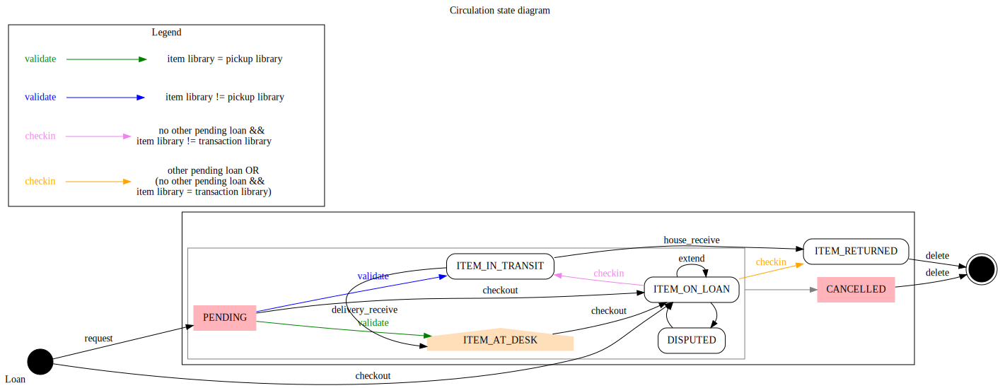

# Circulation

## Circulation state diagram

### States

  * CANCELLED: the loan is cancelled for some reason (the item is missing, the request was deleted before checkout, etc.).
  * DISPUTED: the loan has a special state due to the activity of the patron (overdue, lost, invoiced, etc.). This box is greyed because these states still have to be clarified.
  * ITEM\_AT\_DESK: the item is at the pick-up library desk, ready to be borrowed by the patron.
  * ITEM\_IN\_TRANSIT: the item is in transit from one library to another library, in order to be either checked out or returned.
  * ITEM\_ON\_LOAN: the item is currently borrowed by a patron.
  * ITEM\_RETURNED: the item is returned and the loan came full circle.
  * PENDING: the request exist on one document or one item

### Action

  * **checkin**: return the item from the patron to one library\\
In case of another request (from another "loan" entity) on this item, the current loan is closed (status "ITEM\_RETURNED") and the loan of the request sees its "PENDING" status become automatically validated.
  * **checkout**: the item is checked out for the patron.
  * **delete**: the "loan" entity is deleted, or more probably anonymised and injected in a loan history file.
  * **delivery\_receive**: the requested item is received at the right pickup library.
  * **extend**: the checkout duration is extended.
  * **house\_receive**: the returned item is received at its owning library.
  * **request**: the document or the item is requested for one patron.
  * **validate**: the request is validated, and the item is then either directly available for pickup or sent to its pickup library.

### Action parameters

Parameters for all action:

* transaction\_date
* transaction\_library\_pid
* user\_pid: staff or patron identifier
* item\_pid

action specific parameters:

* **checkin**: return\_date
* **checkout**: patron\_id, start\_date, due\_date
* **extend**: due\_date
* **request**: patron\_pid, expired\_date
* **validate**: patron\_pid
* **delivery\_receive**: patron\_pid
* **house\_receive**
* **delete**

### Consortium model terminology

The current consortial model has 3 levels:

1. Organisation: network of libraries (such as: universities)
2. library: library (for now, with only one loan desk)
3. Location: physical on\_shelf location of items (stores, free\_access\_zone...)

Consortial variables used by the circulation:

* transaction\_library: library/library that performs the transaction
* item\_library: library owning the item
* pickup\_library: library chosen by the patron for pickup
