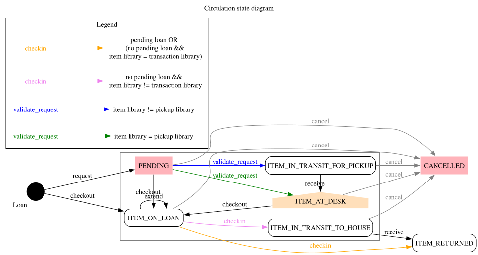

# Circulation

## Circulation state diagram

### States

- `CANCELLED`: the loan is cancelled for some reason (the item is missing, the request was deleted before checkout, etc.).
- `DISPUTED`: the loan has a special state due to the activity of the patron (overdue, lost, invoiced, etc.). This box is greyed because these states still have to be clarified.
- `ITEM_AT_DESK`: the item is at the pick-up library desk, ready to be borrowed by the patron.
- `ITEM_IN_TRANSIT`: the item is in transit from one library to another library, in order to be either checked out or returned.
- `ITEM_ON_LOAN`: the item is currently borrowed by a patron.
- `ITEM_RETURNED`: the item is returned and the loan came full circle.
- `PENDING`: the request exists on one document or one item.

### Actions

- **checkin**: return the item from the patron to one library.
  In case of another request (from another loan entity) on this item, the current loan is closed
  (status `ITEM_RETURNED`) and the loan of the request sees its `PENDING` status become automatically validated.
- **checkout**: the item is checked out for the patron.
- **delete**: the loan entity is deleted, or more probably anonymised and injected in a loan history file.
- **delivery_receive**: the requested item is received at the right pickup library.
- **extend**: the checkout duration is extended.
- **house_receive**: the returned item is received at its owning library.
- **request**: the document or the item is requested for one patron.
- **validate**: the request is validated, and the item is then either directly available for pickup or sent to its pickup library.

### Action parameters

Parameters for all actions:

- `transaction_date`
- `transaction_library_pid`
- `user_pid`: staff or patron identifier
- `item_pid`

Action-specific parameters:

- **checkin**: `return_date`
- **checkout**: `patron_id`, `start_date`, `due_date`
- **extend**: `due_date`
- **request**: `patron_pid`, `expired_date`
- **validate**: `patron_pid`
- **delivery_receive**: `patron_pid`
- **house_receive**: —
- **delete**: —

### Consortium model terminology

The current consortial model has 3 levels:

1. Organisation: network of libraries (such as universities)
2. Library: library (for now, with only one loan desk)
3. Location: physical on-shelf location of items (stores, free-access zone, etc.)

Consortial variables used by the circulation:

- `transaction_library`: library that performs the transaction
- `item_library`: library owning the item
- `pickup_library`: library chosen by the patron for pickup
